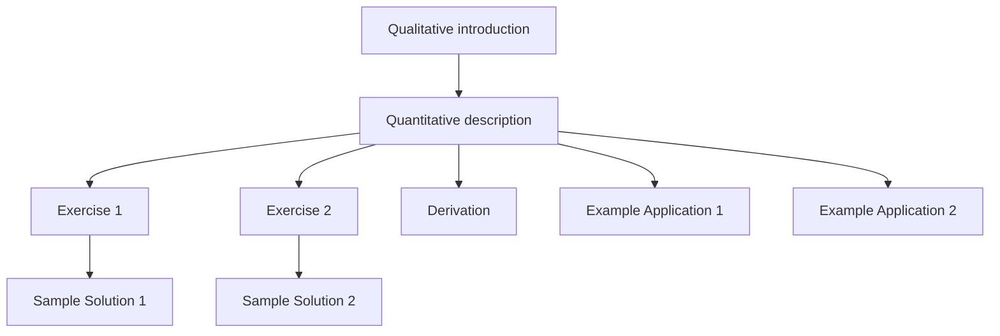

# Concept

The Atomic Learning Platform is different from traditional learning management systems in that it is designed to deliver very short, focused pages of content that can be completed in a few minutes. Each piece of content describes which other pieces of content should be completed before it (prerequisites). The definition of these prerequisites allows the platform to sequence content for each learner into a queue of content that they should complete next.

This means that an individual piece of content may be viewed by learners as part of very different learning paths, depending on their goals. For instance, a page about the quadratic equation might be viewed by one learner who is a physicist on a learning path about ballistic motion, or a business student on a path about profit optimization. The page is relevant to both of their learning journeys, but they will experience it with a different end goal. This allows material to be communally pooled and reused across different learning paths. However, it does lead to some considerations about how to organise and sequence the content on the platform.

# Modularity

Each piece of content should focus on a single, well-defined learning objective. This allows content to be reused in different contexts without confusion, and also minimises the amount of unnecessary content that a learner has to go through to reach their goal. Most content pages will be less than 5 minutes in length, and will rarely exceed 10 minutes. Some pages with exercises will be longer.

# Generality

Content should be written assuming as little prior knowledge as possible. This ensures that the content can be reused in different contexts without confusing learners or requiring additional prerequisite content.

For example, a piece of content introducing a new topic in probability theory should not use the example of genetic inheritance as this requires prior knowledge of biology. Instead, it should use a more general example such as coin tosses or die rolls. However, it would be acceptable to create a second piece of content that contains an example of the concept in relation to genetic inheritance that uses the probability theory page and content about genetic inheritance as prerequisites. This allows the general content to be reused in different contexts, whilst still allowing learning paths to explore discipline-specific applications and examples.

# Escalating Complexity

In many cases, there are many different levels on which a topic can be understood. More learners will require a basic understanding of a topic than an advanced understanding. Content aimed at a more complex understanding of a topic should use content aimed at a more basic understanding of the topic as a prerequisite.

For example, when teaching a complex mathematical equation in physics, the most fundamental page should introduce the relationship at a conceptual, qualitative level. A second page would use the first as prerequisite and introduce the mathematical formulation of the equation and the meaning of the variables and terms. Another page might build on the second and derive the equation. Another set of pages might use the second page as a prerequisite and provide examples of its application. Another set of pages might use the second page as a prerequisite and provide exercises relating to the equation. This allows for different goals and learning paths to use parts of the content relating to the equation without requiring learners to go through unnecessary material. This example is illustrating below; note that each piece of content will likely have other prerequisites.

# Non-Repetition

Content should not be unnecessarily repeated across different pages. If a concept is used in one piece of content and has been introduced in another, this should be included as a prerequisite and it should not be rehashed or repeated. It is allowable and desirable to assume learners have prior knowledge of all prerequisites of a piece of content. This helps to keep the learning experience streamlined and focused, allowing learners to progress more quickly through the material.
